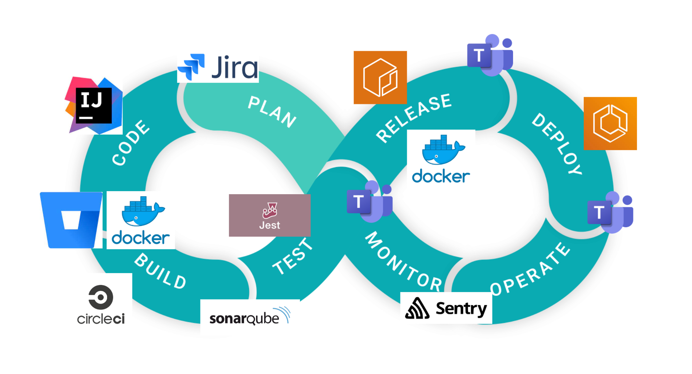
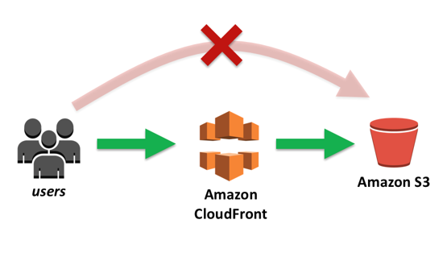
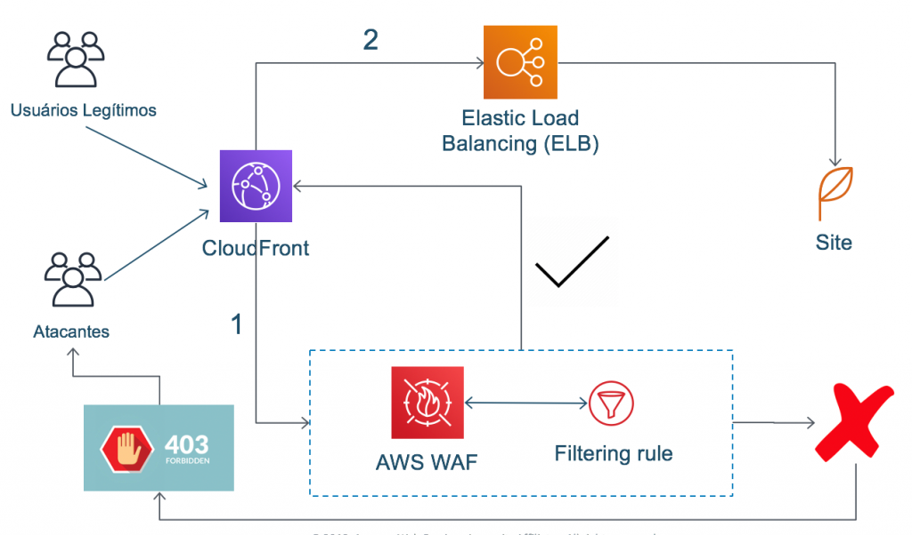
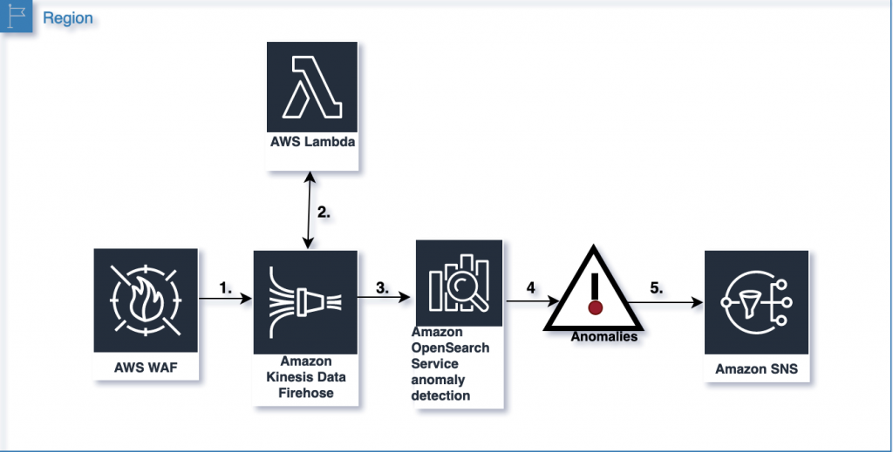

# CI/CD

# Deploy S3-CLoudFront (Blue/Green)

# WAF OWASP 

# WAF and Anomaly detection

---
- [Setup - Monorepo](README_MONOREPO.md)
    - \*Branching (Trunk Based vs Git Flow)
    - \*Atomic Commit
    - Tools
- [CircleCI - CodeQuality](.circleci/config.yml)
    - \*Manual Code Review
    - Automatic Code Review (Sonar)
      - Lint
      - Version Scan
      - SAST
    - \*DAST 
- [Deploy - S3/CLoudFront (Blue/Green)](https://github.com/cdeucher/terraform-aws-monorepo/tree/master/terraform-aws-s3-cloudfront)
    - Security Headers
    - Geographic restrictions
- [WAF - OWASP](#)
- [WAF - Anomaly detection](README_WAF.md)

\*Topic to discuss.
