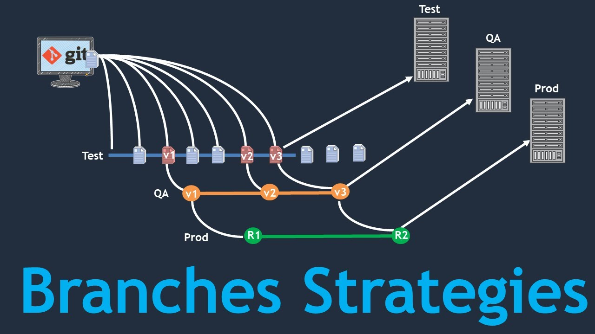

## Branching

 - [Version Numbers | Semantic Versioning](branching/semantic-numbers.md "version number")
 - [Conventional Commits](branching/conventional-commits.md)
 - [Git](branching/git.md)
 - Branching Flow
    - [Git Flow](branching/gitflow.md)
    - [GitHub Flow](https://docs.github.com/en/get-started/quickstart/github-flow)
    - [GitLab Flow](https://www.zup.com.br/blog/git-workflow)
    - [Trunk Based](branching/trunkbased.md)
        - [Feature Flag](flagsmith/readme.md)
    - [Release Flow](branching/releaseflow.md)
 - [Harnds-on](branching/hands-on.md)
 
- References
    - [Release Flow](http://releaseflow.org/#developing)
    - [Trunk Based](https://trunkbaseddevelopment.com/#trunk-based-development-for-smaller-teams)
    - [Git Flow](https://nvie.com/posts/a-successful-git-branching-model/)
    - [GitHub Flow](https://docs.github.com/en/get-started/quickstart/github-flow)
    - [Semantic Versioning](https://semver.org/spec/v2.0.0.html)
    - [Conventional Commits](https://www.conventionalcommits.org/en/v1.0.0/#specification)
