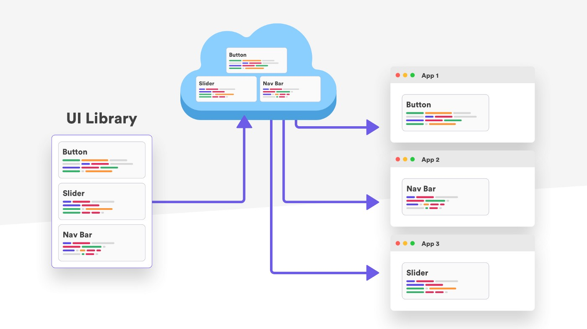

# Frontend
## Monorepo/Branching

 - [GitFlow](branching/gitflow.md)
 - GitHub Flow
 - GitLab Flow
 - Trunk-based development

## CI/CD

## Deploy - S3/CLoudFront (Blue/Green)

## Security Headers

## WAF - OWASP 

## Observability

---
# Backend

## ECS Cluster - Autoscalling

## WAF - OWASP 

## WAF - Anomaly detection

## Logging/Monitoring 

---
- [Setup - Monorepo](README_MONOREPO.md)
    - \*Branching
    - \*Atomic Commit
    - Tools
- [CircleCI - CodeQuality](.circleci/config.yml)
    - \*Manual Code Review
    - Automatic Code Review (Sonar)
      - Lint
      - Version Scan
      - SAST
    - DAST (ZAP) 

- [Deploy - S3/CLoudFront (Blue/Green)](https://github.com/cdeucher/terraform-aws-monorepo/tree/master/terraform-aws-s3-cloudfront)
    - Security Headers
    - Geographic restrictions
- [WAF - OWASP](#)
- [WAF - Anomaly detection](README_WAF.md)
- [Logging/Monitoring ](#)
- [Observability](#)
    - Sentry
    - Bugsnag
    - Datadog

\*Topic to discuss.
