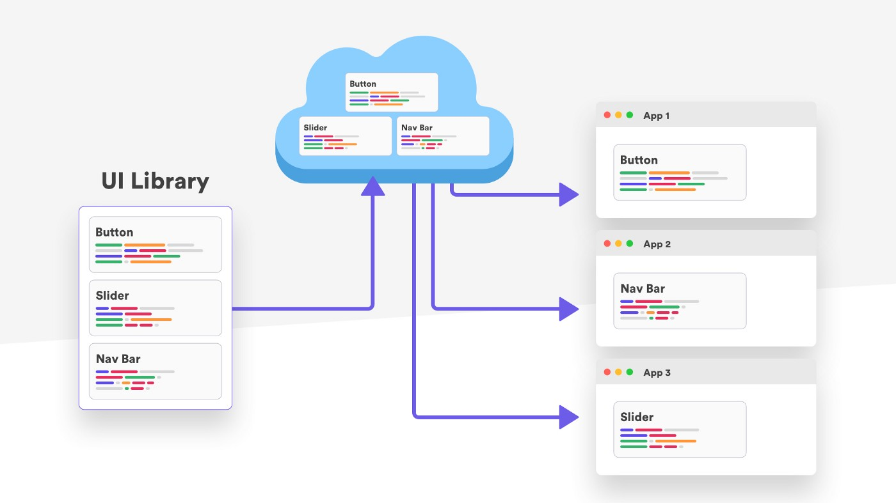

# [Voltar](README.md)



## Environment
- node: v14.19.0
- yarn: 1.22.17
- lerna: 4.0.0
- npx: 6.14.16

## VSCode Extensions
1) Extensions
- dbaeumer.vscode-eslint
- esbenp.prettier-vscode
- vscode-styled-components
- vscode-firefox-debug
2) Debug
- Create folder `.vscode` and inside `launch.json` file.
3)
```bash
nvm use v14.19.0
npx create-react-app app --template typescript
```
3) Lint 
- `yarn add eslint -D`.
- `npx eslint --init`, next, next, ok.
4)
- Create `.prettierrc` file.
5) Setup node version.
```bash
nvm use v14.19.0
npx create-react-app app --template typescript
yarn test
yarn add --dev prettier
```
6) Monorepo management
- Install Lerna, `npm install --global lerna`.
- Create `lerna.json` file.
- Setup `package.json` file:
```
  "workspaces": ["packages/*"},  
```


End) Links
- Project Setup - https://www.jetbrains.com/webstorm/guide/tutorials/react_typescript_tdd/project_setup/
- Eslint/Prettier - https://dev.to/otaviopalma/criando-um-projeto-react-com-typescript-eslint-e-prettier-2okg
- Debug - https://code.visualstudio.com/docs/nodejs/reactjs-tutorial
- Composing - https://www.pluralsight.com/guides/composing-react-components-with-typescript
- Monorepo - https://vijayt.com/post/sharing-components-using-a-monorepo-built-with-lerna-and-yarn-workspace/
           - https://github.com/vijayst/monorepo
- TypeScript - https://www.thisdot.co/blog/getting-started-with-react-and-typescript