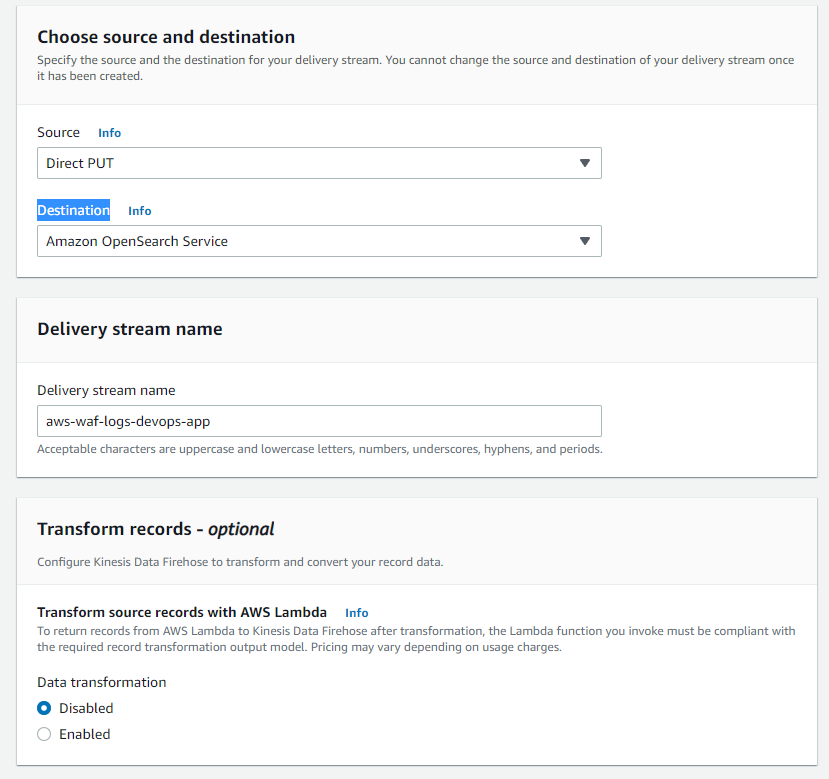
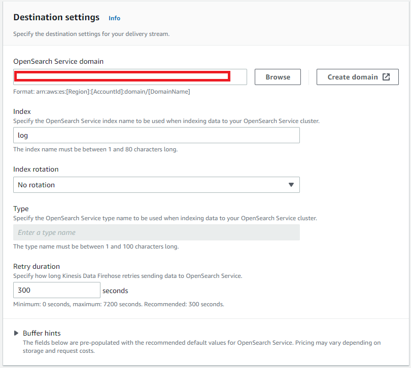
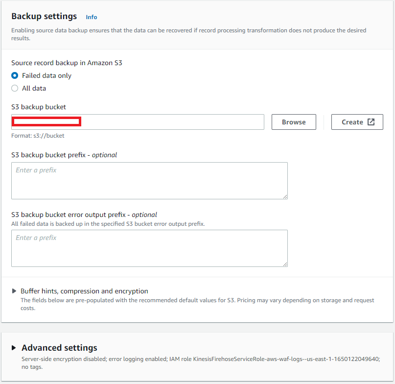
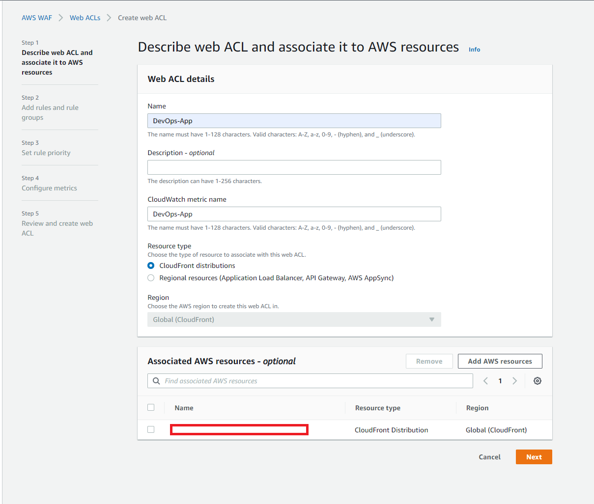
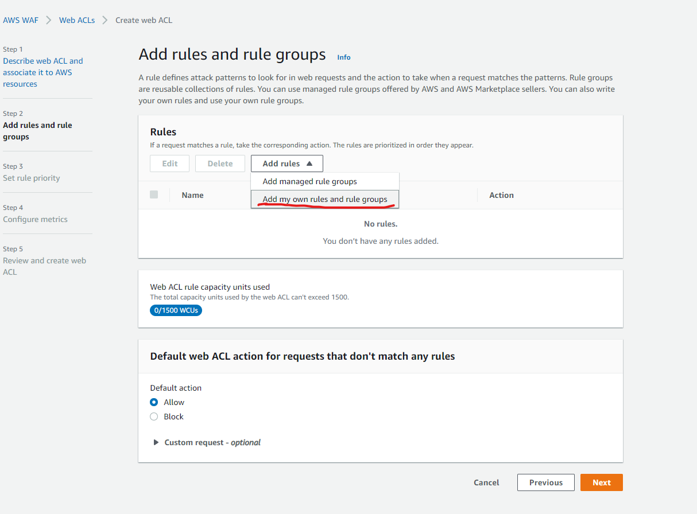
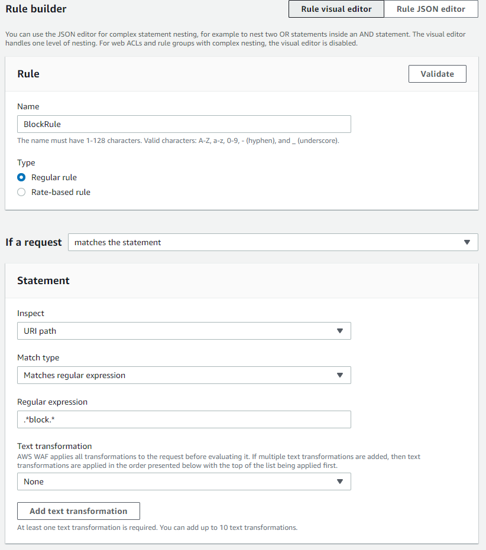
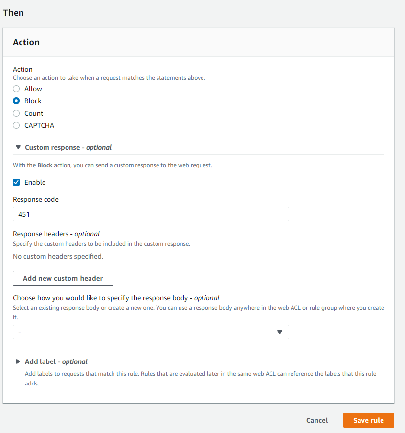
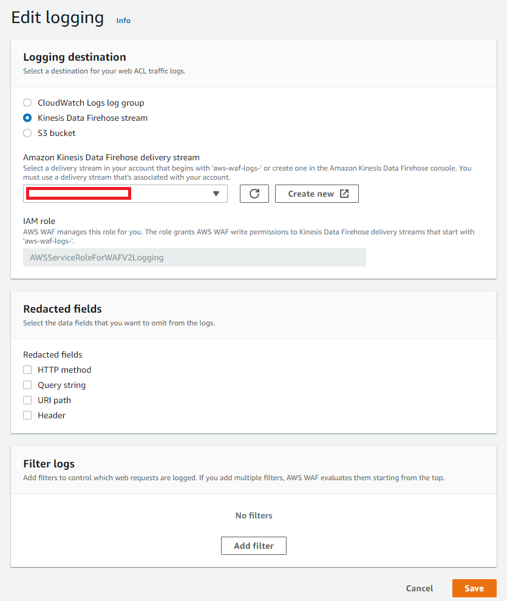

# Setup WAF and Anomaly Detection

## WAF
- Create S3 for static website and CloudFront Distribution.
    - [IAC: S3 CloudFront](https://github.com/cdeucher/terraform-aws-monorepo/tree/master/terraform-aws-s3-cloudfront)

- OpenSearch Service
    * Create domain.
    * Ignore the Custom endpoint setting.
    * For the deployment type, choose Development and testing.
    * For Version, choose the latest version.
    * Under Data nodes, change the instance type to t3.small.search and keep the default value of three nodes.
    * For simplicity in this tutorial, use a public access domain. Under Network, choose Public access.
    * In the fine-grained access control settings, choose Create master user. Provide a user name and password.
    * For Access policy, choose Only use fine-grained access control. In this tutorial, fine-grained access control handles authentication, not the domain access policy.
    * Ignore the rest of the settings and choose Create. New domains typically take 15–30 minutes to initialize, but can take longer depending on the configuration. After your domain initializes, make note of its endpoint.

- Kinesis Delivery streams
    - Create a delivery stream
    
    Be careful with the field: "Delivery stream name", check it in WAF->Logging and Metrics->IAM role.
    
    
- Kunesis Lambda
    - Create lambda:
        - [Lambda](infra/lambda/kinesis.py)
        - [Docs Lambda](https://docs.aws.amazon.com/opensearch-service/latest/developerguide/integrations.html)
    - Open Delivery streams created.
    - Configuration -> Transform records -> Edit -> Enable -> Select Lambda.

- Create WAF ACL
    - Select CloudFront Distributions
    - Associated AWS resources with CF Distribution
    

    - Add my own rules and rule groups
    
    It's entirely for testing purposes
    
    
    - Select CloudFront Distributions -> Logging and metrics -> Enable -> Kinesis Data Firehose stream.
    

- Kibana
    - Fix permission error: [Permission](https://aws.amazon.com/pt/premiumsupport/knowledge-center/opensearch-troubleshoot-cloudwatch-logs/)
        - Abra o OpenSearch Dashboards. Você pode encontrar um link para o OpenSearch Dashboards no resumo do domínio do seu console do OpenSearch Service.
        - No painel de navegação, escolha Segurança.
        - Escolha Funções.
        - Escolha a funçãoall_access.
        - Escolha a guiaUsuários mapeados.
        - Na página de diálogoUsuários mapeados, escolha Gerenciar mapeamento.
        - EmFunções de back-end, insira o ARN da função de execução da função do Lambda.
        - EscolhaMapa. Os seus logs agora devem ser transmitidos para o seu domínio do OpenSearch Service.
    - Create Index
    - [Create Anomaly Detection](https://aws.amazon.com/pt/blogs/security/analyze-aws-waf-logs-using-amazon-opensearch-service-anomaly-detection-built-on-random-cut-forests/)    
    
-     

# Links
- https://docs.aws.amazon.com/opensearch-service/latest/developerguide/gsgcreate-domain.html