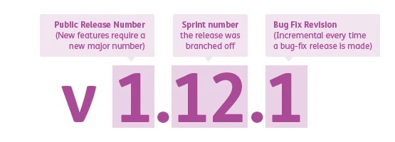

# <o>[Voltar](../README.md)

# Semantic Versioning

---

- MAJOR version when you make incompatible API changes.
- MINOR version when you add functionality in a backward-compatible manner.
- PATCH version when you make backward-compatible bug fixes.

---

### Links
- https://semver.org/spec/v2.0.0.html
- https://gaboesquivel.com/blog/2018/recommendations-to-enhance-your-github-flow/
