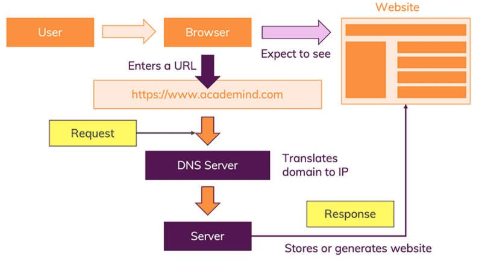
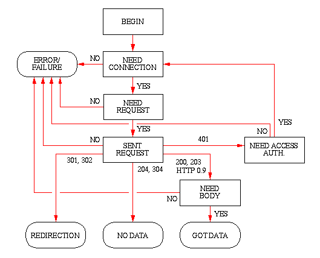

# [Voltar](../README.md)

# Request

[Specification](https://www.w3.org/People/Frystyk/thesis/HTTPFeatures.html)

- HTTP - HyperText Transfer Protocol
- Request
- Response

### Links
- [How the web works](https://academind.com/tutorials/how-the-web-works)
- [How the Web works 2](https://developer.mozilla.org/en-US/docs/Learn/Getting_started_with_the_web/How_the_Web_works)